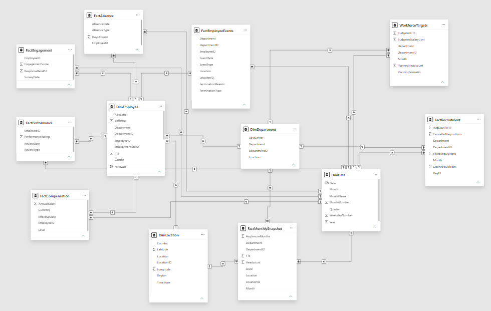
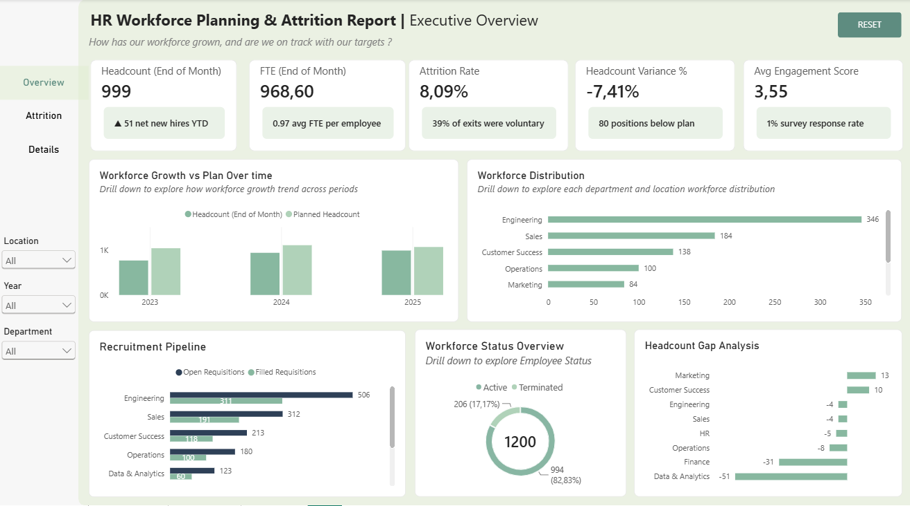
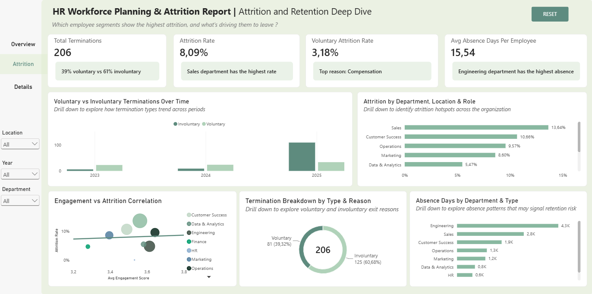
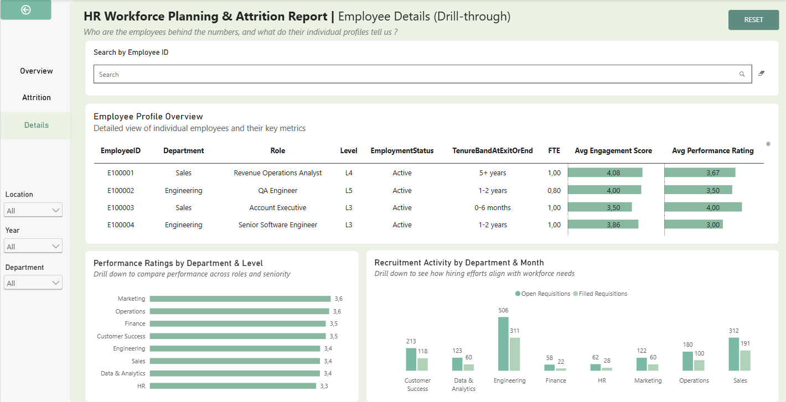

# 👥HR Workforce Planning & Attrition Analytics Report (Power BI)

This project is a comprehensive HR analytics solution designed to monitor workforce growth, identify attrition patterns, and uncover retention risks across an organization. The system tracks key metrics including headcount trends, FTE changes, voluntary and involuntary termination patterns, engagement scores, performance ratings, absence levels, recruitment pipeline health, and workforce target variances. It provides interactive visibility into workforce performance by department, location, role, and employee segment, enabling HR leaders and business executives to identify attrition hotspots, understand retention drivers, and align workforce planning with organizational targets.

This project transforms transactional HR data into an interactive business intelligence dashboard that helps HR leaders identify **where attrition risks are highest, what's driving employees to leave, and where workforce levels fall short of plan.**

---

# 📌 Project Overview

HR departments across organizations generate massive volumes of workforce data daily — from hiring and termination events to engagement surveys, performance reviews, and absence records. Without proper visualization and analysis, identifying attrition patterns, retention risks, and workforce planning gaps can be impossible.

This Power BI report was developed to provide insights into:

- 👥 Workforce headcount and FTE trends over time
- 📉 Attrition patterns across departments, locations, and roles
- 🔍 Voluntary vs involuntary termination reasons and differences
- 💡 Retention drivers — how engagement, performance, absence, tenure, and compensation relate to retention
- 🎯 Workforce target gaps — where actual levels are above or below planned headcount, FTE, or salary
- 🤝 Recruitment effectiveness — how well hiring activity supports workforce needs

The report enables **data-driven decision-making for workforce planning, attrition reduction, and employee retention strategy.**

---

# 🎯 Business Problem

Organizations struggle to answer critical workforce questions:

- **How has headcount and FTE changed over time?**

- **Which departments, locations, or roles show the highest attrition?**

- **What are the main termination reasons, and how do voluntary and involuntary exits differ?**

- **How do engagement, performance, absence, and tenure patterns relate to retention?**

- **Where are actual workforce levels above or below planned targets?**

- **How effectively is recruitment supporting workforce needs?**

Without a centralized analytics dashboard, these insights remain buried in separate HR systems and disconnected spreadsheets.

This dashboard solves the problem by consolidating all workforce and HR metrics into an **interactive Power BI report** that tells the story of workforce health and attrition risk.
---

# 💡 Key Insights & Business Question Analysis

### **How has headcount and FTE changed over time?**
* **Headcount Growth:** Increased from **775 employees (2023)** to **999 employees (2025)**.
* **FTE Trends:** Increased from **749.8** to **968.6**, while average FTE per employee remained stable at **0.97**.
* **Plan Attainment:** Actual workforce remained below plan throughout 2023–2025, but plan attainment improved progressively:
  $$\text{73\% (2023)} \longrightarrow \text{84\% (2024)} \longrightarrow \text{93\% (2025)}$$
* **Workforce Gap Peak:** The largest workforce gap occurred in 2023, particularly in **Q1**, when actual headcount reached only **64.7%** of plan.
* **Overall Trajectory:** The workforce gap narrowed progressively over the three-year period.

### **Which departments, locations, or roles show the highest attrition?**
* **Overall Attrition Rate:** **8.09%** as of the end of 2025.
* **Highest Department Attrition:** **Sales** recorded the highest attrition rate at **13.64%**, with **74 terminations**.
* **Work Location Dynamics:**
  * Within Sales, **remote employees** had the highest attrition rate at **21.24%**, compared with approximately 10–15% across other locations.
  * The main roles contributing to high remote attrition were *Account Executive*, *Revenue Operations Analyst*, and *Sales Management*.
* **Workforce Scale vs. Attrition:** **Engineering** had the largest headcount (**346 employees**) but a relatively low attrition rate of **4.76%**, demonstrating that larger workforce size does not necessarily correspond to higher attrition.

### **What are the main termination reasons, and how do voluntary and involuntary exits differ?**
* **Termination Breakdown:** **206 total terminations**, consisting of:
  * **61%** Involuntary exits
  * **39%** Voluntary exits
* **Primary Drivers:**
  * **Company restructuring:** The dominant driver of involuntary terminations and the main reason overall, accounting for **46%** of all terminations.
  * **Compensation (10.68%)** and **work-life balance:** The main reasons associated with voluntary exits.
* **Temporal Shift:**
  * **2023–2024:** Voluntary terminations were higher than involuntary terminations.
  * **2025:** Total terminations increased to approximately **3×** the previous level, with involuntary exits becoming substantially more prominent.
  * **June 2025:** Peak period where involuntary terminations surged relative to voluntary exits.

### **How do engagement, performance, absence, tenure, and compensation patterns relate to retention?**

* **Engagement vs. Attrition:** Engagement does not show a clear inverse relationship with attrition across departments:
  * *Operations* (~9.6%) and *Sales* (~10.7%) have relatively high engagement scores but still show high attrition.
  * *Finance* has the lowest engagement score but a relatively low attrition rate of approximately 4.7%.
* **Absence Patterns:** Engineering recorded the highest number of absence days, with sick leave being the main absence type.
* **Tenure:** Employees with **2–5 years** of tenure recorded the highest attrition rate.
* **Performance Scores:**
  * *HR* had the lowest performance score (3.3/4) but recorded **0%** attrition.
  * *Sales* had the highest attrition despite a performance score of 3.4/4.
  * *Engineering* and *Data & Analytics* had similar performance scores with attrition around 5%.
 
### **Where are actual workforce levels above or below planned headcount?**
| Department | Headcount vs. Plan | Gap vs. Plan | Status |
| :--- | :---: | :---: | :--- |
| **Marketing** | **+13** | 18.31% | Furthest above plan |
| **Data & Analytics** | **−51** | 50% | Largest workforce shortfall |
| **Finance** | **−31** | 43% | Second-largest shortfall |

* Workforce gaps are concentrated in specific departments, particularly **Data & Analytics** and **Finance**.
  
### **How effectively is recruitment supporting workforce needs?**

| Department | Fill Rate | Actual vs. Plan Headcount | Recruitment Alignment |
| :--- | :---: | :---: | :--- |
| **Customer Success** | 55.00% | +10 | Surplus headcount |
| **Marketing** | 50.00% | +13 | Surplus headcount |
| **Engineering** | 61.64% | −4 | Near plan targets |
| **Sales** | 61.22% | −4 | Near plan targets |
| **Data & Analytics** | 48.78% | −51 | Largest recruitment/workforce gap |
| **Finance** | 38.00% | −31 | Underperforming recruitment targets |

### Departmental Recruitment Highlights:
* **Data & Analytics:** Maintained recruitment activity throughout the year, but the fill rate remained around **~50%**, while the headcount gap increased from **37 to 51 employees** over the three-year period.
* **Finance:** Had intermittent recruitment activity with generally low open positions and fill rates around **50% or below**; the headcount gap improved slightly from **37 to 31 employees**.
---

# 🚀 Strategic Recommendations

### 📍 **Build a Targeted Retention Strategy for Critical Workforce Segments**

Instead of applying a company-wide retention program, prioritize interventions for workforce segments where turnover is most concentrated. For Sales, HR could review  specific role retention factors such as career progression, workload, compensation, and working arrangements, particularly for remote employees. The goal is to address the underlying reasons for turnover rather than continuously replacing departing employees through recruitment.
### 🎯 **Develop a Workforce Recovery Plan for Persistent Staffing Gaps**

Establish a dedicated workforce recovery plan for departments that consistently operate below required staffing levels. HR and department managers should identify the roles contributing most to the gap, set hiring priorities, and establish quarterly staffing targets. Persistent gaps should also be incorporated into future workforce planning cycles to improve the accuracy of headcount forecasts.

### 🚪 **Improve Recruitment Conversion for Specialized Roles**

Where recruitment activity is already present but staffing gaps remain, focus on improving the conversion of open positions into successful hires. This can include reviewing sourcing channels, hiring time, candidate drop-off points, role requirements, and compensation competitiveness. Recruitment performance should be evaluated not only by the number of positions opened, but by how effectively those positions contribute to closing workforce gaps.

### 📊 **Separate Retention Actions for Voluntary and Involuntary Turnover**

Use different management strategies for different types of employee exits. Voluntary turnover should be addressed through initiatives related to compensation, work-life balance, career development, and employee experience, while involuntary turnover requires closer examination of organizational restructuring, workforce planning, and performance-management processes. This prevents different types of turnover from being treated as the same problem.

### 🤝 **Strengthen Workforce Planning Through Continuous Plan–Actual Review**

Move from annual workforce planning toward a continuous Plan → Actual → Gap → Action cycle. Workforce plans should be reviewed regularly against actual headcount, FTE, attrition, and recruitment outcomes. Persistent deviations should feed back into subsequent planning cycles so that workforce targets become increasingly aligned with actual organizational demand.

### 📉 **Establish an Early Warning Workforce Monitoring Framework**

Create a recurring HR monitoring process that combines attrition, absence, tenure, engagement, performance, and recruitment indicators rather than relying on a single metric. Departments showing multiple unfavorable signals can then be prioritized for deeper investigation before the issue develops into a larger workforce shortage.

---

# 📂 Dataset

The dataset represents **HR workforce planning data** covering employee profiles, monthly headcount snapshots, hiring and termination events, compensation, performance reviews, engagement surveys, absences, recruitment activity, and workforce targets.

### 📊 Dataset Scope

- Multi-department organization across multiple locations and regions
- Employee-level profiles with demographic and employment data
- Monthly workforce snapshots with headcount and FTE
- Transactional events for hiring and terminations
- Time period: **2023–2025**

### 📑 Dimension Tables

| Table | Purpose | Key Fields |
|-------|---------|-----------|
| **DimEmployee** | Employee profiles | EmployeeID, Department, Role, Level, Location, Gender, HireDate, TerminationDate, EmploymentStatus, TerminationType, TerminationReason, FTE, TenureBandAtExitOrEnd |
| **DimDepartment** | Department reference data | DepartmentID, Department, Function, CostCenter |
| **DimLocation** | Geographic hierarchy | LocationID, Location, Country, Region, TimeZone, Latitude, Longitude |
| **DimDate** | Time dimension | Date, Month, Year, Quarter, MonthNumber, MonthName, WeekdayNumber |

### 📑 Fact Tables

| Table | Purpose | Key Metrics |
|-------|---------|-----------|
| **FactMonthlySnapshot** | Monthly workforce state | Headcount, FTE, AvgTenureMonths |
| **FactEmployeeEvents** | Hiring and termination transactions | EventType, TerminationType, TerminationReason |
| **FactCompensation** | Salary records | AnnualSalary, Level, Currency |
| **FactPerformance** | Performance reviews | PerformanceRating, ReviewType |
| **FactEngagement** | Engagement surveys | EngagementScore, ResponseRatePct |
| **FactAbsence** | Absence tracking | AbsenceType, DaysAbsent |
| **FactRecruitment** | Recruitment pipeline | OpenRequisitions, FilledRequisitions, CancelledRequisitions, AvgDaysToFill |
| **WorkforceTargets** | Planned workforce benchmarks | PlannedHeadcount, BudgetedFTE, BudgetedSalaryCost, PlanningScenario |

### 📈 Key Metrics and KPIs

Core measures tracked:

- **Headcount (End of Month)** = SUM(FactMonthlySnapshot[Headcount])
- **FTE (End of Month)** = SUM(FactMonthlySnapshot[FTE])
- **Attrition Rate** = DIVIDE(Total Terminations, Headcount (End of Month))
- **Voluntary Attrition Rate** = DIVIDE(Voluntary Terminations, Headcount (End of Month))
- **Headcount Variance %** = DIVIDE(Headcount Variance, Planned Headcount)
- **Fill Rate** = DIVIDE(Filled Requisitions, Open Requisitions)
- **Avg Engagement Score** = AVERAGE(FactEngagement[EngagementScore])
- **Avg Absence Days Per Employee** = DIVIDE(Total Absence Days, Current Headcount)

---

# 🧹 Data Cleaning & Preparation

Data preparation was completed using **Power Query and DAX**.

Key steps included:

- Standardizing DepartmentID and LocationID formats across all tables to ensure relationship integrity
- Trimming and cleaning ID columns to remove hidden characters that could break joins
- Validating date sequences (HireDate before TerminationDate where applicable)
- Creating a Date Hierarchy (Year → Quarter → Month) in DimDate for drill-down functionality
- Ensuring MonthName sorts chronologically using MonthNumber as the sort-by column
- Handling BLANK values in termination measures using COALESCE to prevent visual errors
- Setting up DimDate as the official date table and disabling Power BI's auto date/time intelligence
- Creating dynamic reference label measures with REMOVEFILTERS to ensure KPI cards work independently of slicer selections

The final dataset was optimized for **fast dashboard performance and multi-dimensional drill-down analysis.**

---

# 🧠 Data Model

### 🔗 Relationships

* **Central Hub — DimEmployee:** Acts as the primary dimension connecting to 5 fact tables (FactEmployeeEvents, FactCompensation, FactPerformance, FactEngagement, FactAbsence) and 2 dimension tables (DimDepartment, DimLocation), creating the snowflake pattern.

* **Conformed Dimensions:** DimDepartment, DimLocation, and DimDate connect to multiple fact tables (FactMonthlySnapshot, FactRecruitment, WorkforceTargets), enabling cross-functional analysis across workforce snapshots, recruitment, and planning targets.

* **One-to-Many Relationships:** All relationships follow the standard $1 \rightarrow *$ pattern with **Single cross-filter direction**, ensuring filters flow correctly from dimensions down to fact tables without unexpected bi-directional filtering.

* **15 active relationships** connect all 12 tables into a cohesive analytical model.

This robust multi-fact model enables **cross-subject area analysis (e.g., correlating engagement scores against attrition rates, or comparing actual headcount against planned targets), efficient filtering, and high-performance dashboard queries.**

---

# 📊 Dashboard Structure

The report consists of **three analytical pages**, each filterable by Year, Department, and Location (plus TerminationType on Page 2), designed for different HR leadership personas. The report also features a **bookmark-based guided tour** for first-time users.

---

# 📈 Page 1 — Executive Overview

### 🎯 Purpose

*"How has our workforce grown, and are we on track with our targets?"*

### 📌 KPIs

- 👥 **Headcount (End of Month)** — with contextual reference label showing net new hires YTD
- 📊 **FTE (End of Month)** — with contextual reference label showing average FTE per employee
- 📉 **Attrition Rate** — with contextual reference label showing % of exits that were voluntary
- 🎯 **Headcount Variance %** — with contextual reference label showing positions below plan
- 💡 **Avg Engagement Score** — with contextual reference label showing survey response rate

### 📊 Visuals

- **Workforce Distribution** — Headcount by Department → Location → Level, enabling users to drill into workforce composition hierarchically

- **Workforce Growth vs Plan**  — Actual vs Planned Headcount trend over Year → Quarter → Month, highlighting gaps between workforce reality and organizational targets

- **Headcount Gap Analysis** — Headcount Variance by Department with conditional formatting (red for understaffed, green for overstaffed), instantly revealing where workforce gaps exist

- **Workforce Status Overview**  — Active vs Terminated employee split, showing the overall workforce health ratio

- **Recruitment Pipeline**  — Open vs Filled Requisitions by Department, revealing how effectively recruitment is closing workforce gaps

---

# 📉 Page 2 — Attrition & Retention Deep Dive

### 🎯 Purpose

*"Which employee segments show the highest attrition, and what's driving them to leave?"*

### 📌 KPIs

- 📉 **Total Terminations** — with reference label showing voluntary vs involuntary split
- 📊 **Attrition Rate** — with reference label identifying the department with the highest rate
- 🚪 **Voluntary Attrition Rate** — with reference label showing the top voluntary exit reason
- 🤒 **Avg Absence Days Per Employee** — with reference label identifying the department with the highest absence

### 📊 Visuals

- **Termination Breakdown by Type & Reason**  — Drills from TerminationType (Voluntary/Involuntary) → TerminationReason, answering why employees are leaving

- **Attrition by Department, Location & Role**  — Attrition Rate by Department → Location → Role, identifying exactly where attrition hotspots exist

- **Engagement vs Attrition Correlation**  — Avg Engagement Score vs Attrition Rate by Department → Location, with bubble size representing Total Terminations, revealing whether low engagement correlates with higher attrition

- **Voluntary vs Involuntary Terminations Over Time**  — Termination counts by type across Year → Quarter → Month, showing how the nature of exits has evolved

- **Absence Days by Department & Type**  — Total Absence Days by Department → AbsenceType, surfacing absence patterns that may signal retention risks

---

# 📋 Page 3 — Employee Details (Drill-Through)

### 🎯 Purpose

*"Who are the employees behind the numbers, and what do their individual profiles tell us?"*

### 📌 KPIs

- 👥 **Headcount (End of Month)** — context-aware based on drill-through selection
- 📉 **Attrition Rate** — context-aware based on drill-through selection
- 💡 **Avg Engagement Score** — context-aware based on drill-through selection

### 📊 Visuals

- **Employee Profile Overview** (Table) — Detailed employee-level data including EmployeeID, Department, Role, Level, Location, EmploymentStatus, TenureBand, FTE, Avg Engagement Score, Avg Performance Rating, and Total Absence Days with conditional formatting on engagement scores

- **Recruitment Activity by Department & Month** (ZoomCharts Drill Down Bar) — Open vs Filled Requisitions by Department → Month, showing hiring efforts for the drilled-through segment

- **Performance Ratings by Department & Level** (ZoomCharts Drill Down Column) — Avg Performance Rating by Department → Level, comparing performance across roles and seniority

### 🔗 Drill-Through Fields

Users can right-click any data point on Pages 1 or 2 and drill through to this page filtered by:
- Department
- Location
- Role
- EmploymentStatus

---

# 🔚 Conclusion

This HR workforce planning dashboard transformed raw employee and operational data into a strategic tool for HR and business leaders. The data tells a clear story: attrition is not a uniform problem — it concentrates in specific departments, locations, and roles, driven by distinct factors that vary by segment. Instead of guessing where workforce risks exist or why people leave, stakeholders can now see it clearly: which departments are furthest below target, whether voluntary or involuntary exits dominate, how engagement and absence patterns correlate with turnover, and whether recruitment is keeping pace with demand. For organizations managing complex workforce planning across multiple departments and locations, this kind of analysis is essential — transforming the question from "Are we losing people?" to "Why are we losing them, and what can we do about it before it impacts the business?"

---

# ✨ Key Dashboard Features

- ✅ 9 Drill Down visuals for hierarchical exploration (Department → Location → Level/Role)
- ✅ Interactive slicers and cross-filters for dynamic exploration (Year, Department, Location, TerminationType)
- ✅ Dynamic KPI reference labels that update contextually with slicer selections
- ✅ Drill-through from summary pages to employee-level detail (Page 3)
- ✅ Bookmark-based guided tour for first-time user onboarding
- ✅ Actual vs Planned workforce comparison with PlanningScenario support
- ✅ Voluntary vs Involuntary termination breakdown with drill-down to specific reasons
- ✅ Engagement-attrition correlation analysis via scatter plot
- ✅ Recruitment pipeline tracking with fill rate metrics
- ✅ 40 DAX measures organized across 6 display folders (KPI, Headcount & FTE, Attrition, Targets, Retention, Recruitment)
- ✅ Consistent page-level storytelling with question-format subtitles

---

**Last Updated:** Sep 2026
